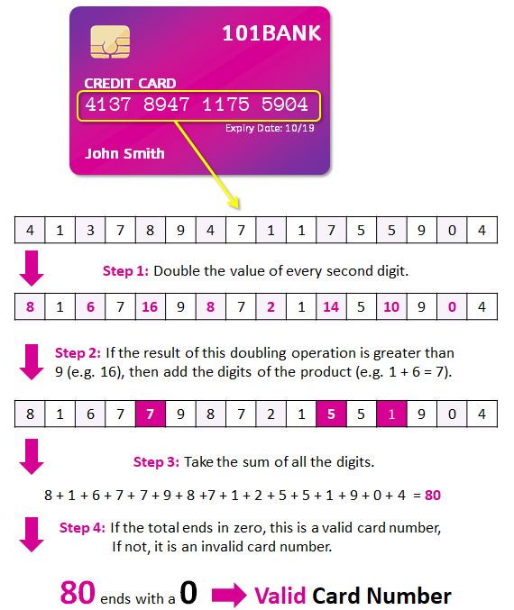
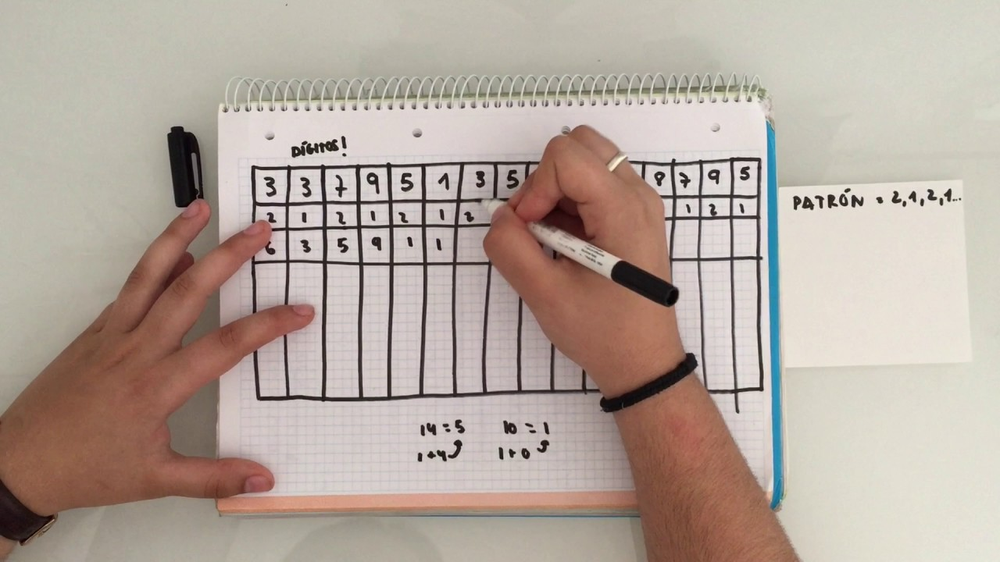

 # Validador de cartão de crédito - ShopCard

 https://vanessavb92.github.io/SAP007-card-validation/
 1. Introdução
  Nosso site tem como objetivo ajudar compradores durante uma compra a verificar se aquele cartão que  estarão utilizando é validopor isso criamos o validador de         cartão. Para validar o seu cartão de crédito, utilizamos a análise através do Algoritmo de Luhn que é a forma como é mais conhecida, ou também como é chamado de      módulo 10. O algoritmo de Luhn é um método de soma de verificação, que é usado para validar números de identificação, como o IMEI de telefones celulares, cartões de crédito etc. Fonte Wikipedia.

Segue abaixo os passos para realizar essa validação:

1º Começando da direita para a esquerda, multiplique por dois cada digito par;

2º Caso a multiplicação dos dígitos resulte em um número com dois digitos, some os digitos para obter um número de apenas um dígito;

3º Agora adicione os digitos ímpares que não foram multiplicados, aos números pares que foram multiplicados;

4º Agora some todos os dígitos deste número, se a soma final for divisível por 10, o número do cartão de crédito é válido, se não for divisível por 10, o número do    cartão é inválido.

2. Resumo do projeto
Nesse projeto quis mostrar como é feita a validação de um cartão de crédito. Devido a atual realidade, com a pândemia Covid-19 o número de compras pela internet cresceu de forma gigantesca, sendo assim, busquei trazer o usuário para dentro desse espaço e mostrar como funciona o Algoritmo de Luhn para validar seu cartão em suas compras online.

3. Design do Projeto
O projeto foi todo planejado em busca de proporcionar ao usuário um ambiente agradável e seguro, trazendo o que há de melhor no momento da sua validação.

6. Tecnologias Utilizadas
HTML5
CSS3
JavaScript Vanilla
Git
GitHub
Node.js
9. Considerações Finais
Esse foi meu primeiro projeto no mundo da tecnologia, desejo daqui à algum tempo poder olhar com muito carinho pra ele e poder enxergar minha evolução. Agradeço toda a equipe do Laboratótia, ao meu squad que foi o 5, e todas as colegas Laboratorians que contribuíram direta ou indiretamente para a realização de projeto. Gratidão.

<td align="center">
      <a href="https://github.com/vanessavb92">
    
  
   <b>Vanessa Borges</b> 
    
